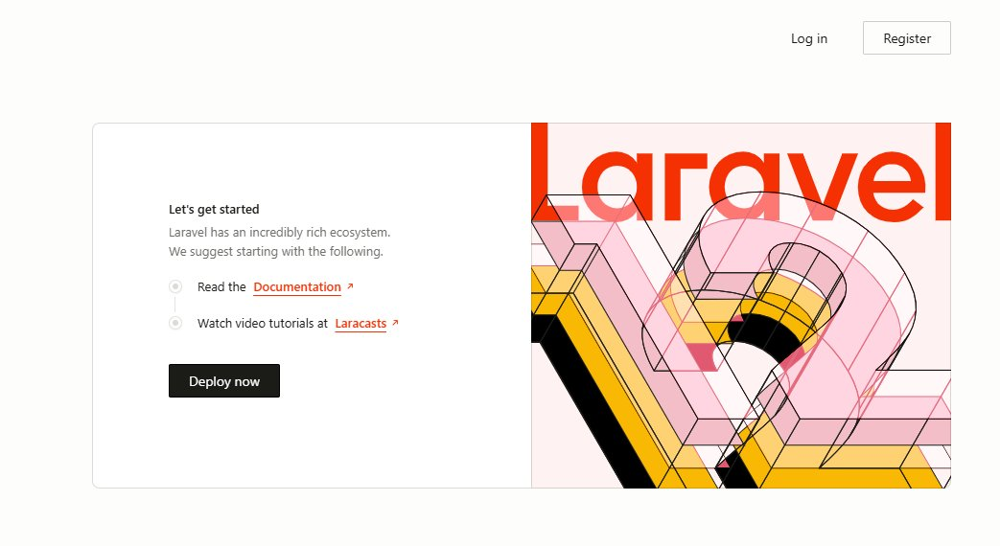
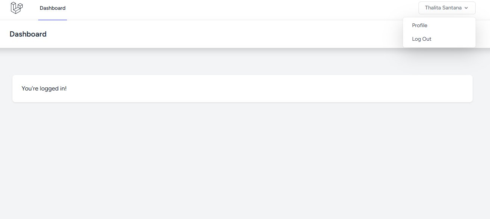
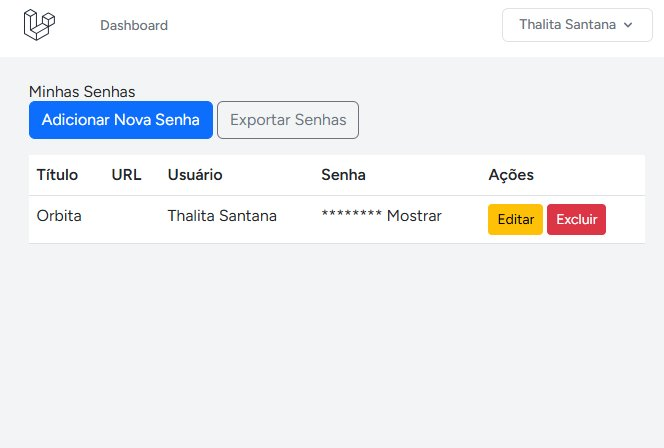
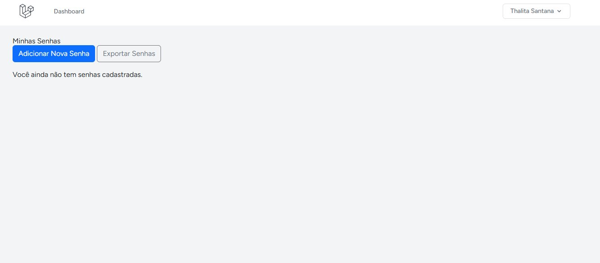
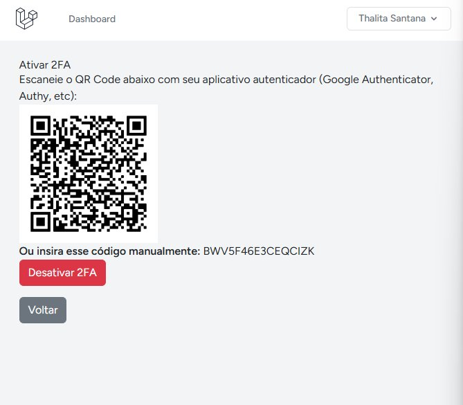

# 🔐 Cofre de Senhas

Aplicação web segura para gerenciamento de senhas, desenvolvida com **PHP/Laravel**. Permite que usuários cadastrem, visualizem, editem e excluam senhas de forma segura, com criptografia de dados, autenticação em dois fatores (2FA) e exportação cifrada.

---

## 📸 Screenshots

### Tela Inicial


### Dashboard


### Minhas Senhas


### Adicionar Nova Senha


### Autenticação em Dois Fatores (2FA)


---

## ✨ Funcionalidades

- **Autenticação Segura**
  - Cadastro com validação de força de senha
  - Verificação de e-mail obrigatória
  - Login seguro com Laravel Breeze
  - Autenticação em Dois Fatores (2FA) com Google Authenticator

- **Gerenciamento de Senhas (CRUD)**
  - Listagem de senhas com título, URL e usuário
  - Criação e edição com criptografia no banco de dados
  - Exclusão com confirmação
  - Visualização segura com descriptografia sob demanda

- **Segurança**
  - Senhas armazenadas criptografadas com `Crypt::encryptString()`
  - Autorização por Policy — cada usuário acessa apenas suas próprias senhas
  - 2FA com Google Authenticator (TOTP)
  - Secret do 2FA criptografado no banco de dados

- **Extras**
  - Exportação de senhas em arquivo cifrado (.enc)
  - Interface responsiva com Tailwind CSS e Bootstrap
  - Dark mode

---

## 🛠️ Tecnologias

| Camada | Tecnologia |
|--------|-----------|
| Backend | PHP 8.1+, Laravel 10+ |
| Frontend | Blade, Tailwind CSS, Bootstrap 5, Alpine.js |
| Banco de Dados | SQLite |
| Autenticação | Laravel Breeze, Google2FA |
| Segurança | Laravel Crypt, PasswordPolicy, 2FA TOTP |

---

## ⚙️ Instalação

### Pré-requisitos
- PHP 8.1+
- Composer
- Node.js & NPM

### Passo a passo

```bash
# 1. Clone o repositório
git clone https://github.com/thalitadev0/cofre-senhas.git
cd cofre-senhas

# 2. Instale as dependências PHP
composer install

# 3. Instale as dependências Node
npm install

# 4. Configure o ambiente
copy .env.example .env
php artisan key:generate

# 5. Execute as migrations
php artisan migrate

# 6. Compile os assets
npm run dev

# 7. Suba o servidor (em outro terminal)
php artisan serve
```

Acesse em: **http://localhost:8000**

---

## 🔒 Segurança Implementada

### Criptografia de Senhas
Todas as senhas são criptografadas antes de serem salvas no banco usando `Crypt::encryptString()` do Laravel, que utiliza AES-256-CBC.

### Policy de Autorização
Cada operação (visualizar, editar, excluir) verifica se o usuário autenticado é o dono da senha através da `PasswordPolicy`, impedindo acesso a dados de outros usuários.

### 2FA com Google Authenticator
O secret do 2FA é gerado de forma única por usuário, criptografado antes de ser salvo no banco, e validado via TOTP (Time-based One-Time Password).

### Exportação Segura
As senhas exportadas são descriptografadas, serializadas em JSON e novamente criptografadas antes de serem enviadas como arquivo `.enc`.

---

## 👤 Autora

**Thalita Santana Cruz da Silva**

- 📧 [santanathwlita@gmail.com](mailto:santanathwlita@gmail.com)
- 💼 [LinkedIn](https://www.linkedin.com/in/thalitasantanacruz/)
- 🐙 [GitHub](https://github.com/thalitadev0)

---

## 📄 Licença

Este projeto está sob a licença MIT.
